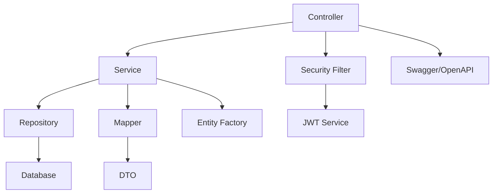
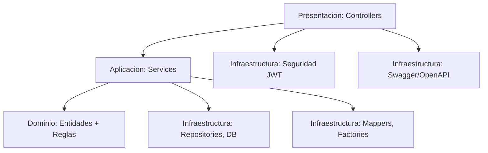

# API REST BD Pelicula - Apuntes

## Que es este proyecto

API REST para gestionar peliculas, directores y generos. Permite listar, crear,
actualizar y borrar, con paginacion, filtros y seguridad JWT.

## Arquitectura (limpia y clara)

- Controller: expone endpoints REST y valida entrada/salida.
- Service: contiene la logica de negocio y orquesta repositorios.
- Repository: acceso a datos (JPA).
- DTO + Mapper: separa la API publica de las entidades internas.
- Entity Factory: crea/actualiza entidades desde DTOs de forma centralizada.
- Security Filter + JWT Service: valida el token en cada request.
- Swagger/OpenAPI: documenta la API y permite probarla.

## Arquitectura limpia (capas)

- Presentacion: recibe HTTP y responde JSON.
- Aplicacion: coordina casos de uso.
- Dominio: entidades JPA y reglas de validacion.
- Infraestructura: persistencia, mappers y detalles tecnicos.

En este proyecto la arquitectura limpia se aplica sin mover paquetes: cada capa
se identifica por responsabilidad.

- Presentacion: controller, exception (GlobalExceptionHandler) y ApiError.
- Aplicacion: srv y srv/impl.
- Dominio: model/db (entidades) y reglas de validacion.
- Infraestructura: repository, security, config, helper y srv/mapper.

## Tecnologias

- Spring Boot 3.2.x
- Spring Web + Spring Data JPA
- PostgreSQL
- Spring Security + JWT
- MapStruct
- Springdoc OpenAPI (Swagger UI)

## Estructura del proyecto

- src/main/java/.../controller: endpoints REST (CRUD, login)
- src/main/java/.../srv: interfaces de servicio
- src/main/java/.../srv/impl: logica de negocio
- src/main/java/.../repository: JPA repositories
- src/main/java/.../model/db: entidades JPA
- src/main/java/.../model/dto: DTOs de entrada/salida
- src/main/java/.../security: JWT, filtro y utilidades
- src/main/java/.../exception: errores controlados
- src/main/java/.../helper: utilidades (paginacion)
- src/main/resources/application.properties: config

## Como funciona el CRUD

- Create: recibe un DTO de creacion, valida, mapea a entidad y guarda.
- Read: consulta por id o lista paginada/filtrada.
- Update: busca entidad, aplica cambios del DTO y guarda.
- Delete: valida existencia y elimina.

En este proyecto el CRUD esta separado en:
- Controller: recibe request, devuelve response.
- Service: hace validaciones de negocio, carga dependencias (director/genero) y llama a repository.
- Repository: ejecuta la consulta JPA.

## Seguridad con JWT (que hice y como funciona)

Que es:
- JWT es un token que identifica al usuario en cada peticion.

Que he hecho:
- He creado un login que devuelve el token.
- He creado un filtro que valida el token en cada request.
- He configurado que ciertas rutas esten abiertas y otras protegidas.

Como se hace en este proyecto:
- Login: POST /api/v1/auth/login
- El login devuelve un token JWT.
- En las peticiones protegidas se envia:
  - Header: Authorization: Bearer <token>

Reglas principales (ver SecurityConfig):
- Swagger y login abiertos.
- GET a /api/v1/** abierto.
- POST/PUT/DELETE a /api/v1/peliculas/** requieren token.
- El resto de endpoints de escritura tambien requieren token.

Usuario en memoria para pruebas:
- username: alumno
- password: 1234
## Swagger / OpenAPI (documentacion)

Que es:
- Swagger genera una documentacion interactiva de la API.

Que he hecho:
- He configurado OpenAPI en el proyecto.
- He añadido anotaciones en los controllers para describir endpoints y errores.

Como se usa:
- Swagger UI: /swagger-ui/index.html
- OpenAPI JSON: /api-docs

Que aporta:
- Documentacion de endpoints (summary, responses, ejemplos).
- Pruebas rapidas desde el navegador.
- Ayuda a entender contratos de entrada/salida.

## Gestion de excepciones

Que es:
- Centralizar los errores para que la API responda siempre con el mismo formato.

Que he hecho:
- He creado un manejador global de excepciones.
- He creado una respuesta de error comun (ApiError).

Como se ve:
- 400: validacion de parametros o body.
- 404: entidad no encontrada.
- 409: violacion de integridad.
- 500: error no controlado.

## Endpoints principales

Peliculas:
- GET /api/v1/peliculas (paginado + filtro nombre)
- GET /api/v1/peliculas/{id}/info
- GET /api/v1/peliculas/orden/{direccionOrden}
- GET /api/v1/peliculas/all
- GET /api/v1/peliculas/director/{directorId}
- GET /api/v1/peliculas/year/{year}
- POST /api/v1/peliculas
- PUT /api/v1/peliculas/{id}
- DELETE /api/v1/peliculas/{id}

Directores:
- GET /api/v1/directores
- GET /api/v1/directores/{id}/info
- POST /api/v1/directores
- PUT /api/v1/directores/{id}
- DELETE /api/v1/directores/{id}

Generos:
- GET /api/v1/generos
- GET /api/v1/generos/{id}
- POST /api/v1/generos
- PUT /api/v1/generos/{id}
- DELETE /api/v1/generos/{id}

Auth:
- POST /api/v1/auth/login

## Configuracion importante

Archivo: src/main/resources/application.properties
- Puerto: server.port=8090
- BD: PostgreSQL (jdbc:postgresql://localhost:5432/pelicula)
- JWT: jwt.secret, jwt.expiration-ms
- Swagger: springdoc.api-docs.path=/api-docs

Scripts SQL en el root:
- create_database.sql
- insert_data.sql

## Principios SOLID aplicados (nivel alumno)

Que es:
- SOLID son reglas para que el codigo sea claro, separando responsabilidades.

Que he hecho:
- SRP: cada clase tiene una responsabilidad clara.
  - Controllers solo manejan HTTP.
  - Services solo orquestan la logica.
  - Mappers convierten entre entidades y DTOs.
- DIP: los controllers dependen de interfaces (srv) y no de implementaciones.
- OCP: la paginacion/ordenacion se centraliza con helpers reutilizables.

Como se ve en este proyecto:
- Helpers de paginacion separados como en instituto:
  - PaginationRequest (modelo de paginacion)
  - PaginationRequestConverter (params -> modelo)
  - PaginationFactory (crea Pageable)
- Services con resolucion de dependencias en helpers:
  - PeliculaDependencyResolver
  - DirectorDependencyResolver
  - GeneroDependencyResolver

## Resumen de lo que se ha hecho

- Swagger configurado como en otros proyectos (OpenApiConfig + propiedades).
- Anotaciones Swagger en controllers con respuestas y ejemplos.
- Seguridad JWT con filtro y whitelist de Swagger.
- Paginacion y ordenacion con validacion de campos (helpers estilo instituto).
- Resolucion de dependencias separada en helpers de service.
- DTOs y mappers para separar API y BD.

## Como ejecutar

1) Arrancar PostgreSQL y crear la BD con create_database.sql
2) (Opcional) cargar datos con insert_data.sql
3) Ejecutar la app (mvn spring-boot:run)
4) Abrir Swagger en /swagger-ui/index.html
